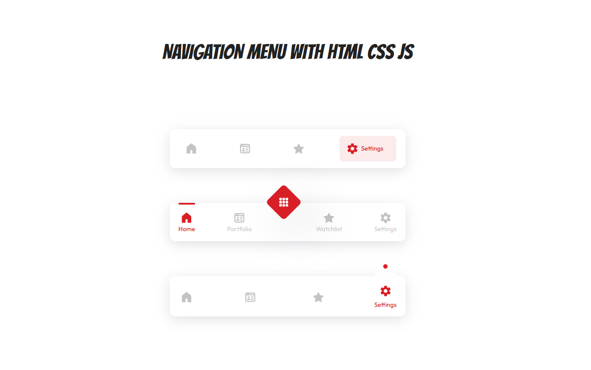

# Tabbar UI Component with HTML, SCSS, and JavaScript

This repository contains a customizable tabbar UI component built using HTML, SCSS, and JavaScript. The design features smooth animations and a modern look, perfect for incorporating into various web projects.



## Features

- **Modern Design:** Clean and visually appealing interface.
- **Customizable:** Easily modify colors and styles with SCSS.
- **Smooth Animations:** Enhances user experience with fluid transitions.

## Installation

Clone the repository to your local machine using:

```bash
git clone https://github.com/Bope142/tabbar-ui-html-css.git
```

## SCSS Compilation

If you make any changes to the SCSS files, you will need to compile them to CSS. You can use a tool like sass to do this:

```bash
sass styles.scss styles.css
```

## Customization

You can customize the tabbar by modifying the SCSS variables in styles.scss to change colors, sizes, and other styles.

## Author

Norbert Yemuang 🚀
